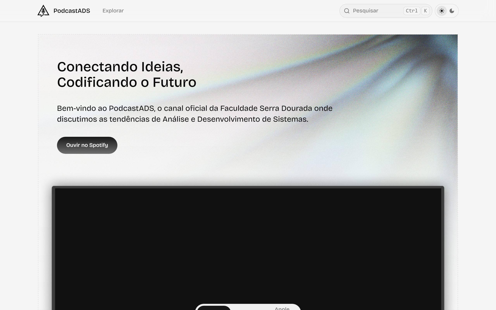

# PodcastADS - Faculdade Serra Dourada



> **Onde o código encontra a conversa.** O portal oficial de tecnologia dos alunos de Análise e Desenvolvimento de Sistemas (ADS) da Faculdade Serra Dourada.

## Sobre o Projeto

O **PodcastADS** é uma iniciativa estudantil dedicada a conectar alunos, professores e profissionais do mercado. Nossa missão é fortalecer o ecossistema acadêmico através da disseminação de conhecimento, tendências de mercado e soft skills essenciais para o futuro desenvolvedor através de áudio, blog e workshops presenciais.

## Objetivos do Projeto (Eixo Tecnológico)

Para atender aos requisitos acadêmicos e do mercado, o PodcastADS está focado em três pilares fundamentais:

1. **Gerenciamento de Conteúdo (CMS):** Sistema responsivo para o cadastro, edição e publicação de episódios, permitindo a gestão completa do ciclo de vida do podcast.
2. **Automação de Estatísticas:** Implementação de rotas e scripts para a coleta automatizada de dados de audiência e engajamento das plataformas de streaming.
3. **Painel de BI (Business Intelligence):** Interface analítica para visualização de dados, facilitando a tomada de decisão baseada em métricas reais de audiência.

## Diferenciais

- **Portal Comunicativo**: Além de uma ferramenta técnica, o site funciona como um hub de informações sobre a Faculdade Serra Dourada e o curso de ADS.
- **Pautas Colaborativas**: Alunos sugerem os temas dos próximos episódios e participam ativamente da curadoria.
- **Dashboard ElevenLabs-Style**: Área administrativa de alta fidelidade para gestão de episódios e análise de dados.

## Estrutura do Monorepo

O portal utiliza uma arquitetura moderna de monorepo, facilitando a contribuição em diferentes camadas do sistema.

| Pacote                                       | Descrição no Contexto do PodcastADS                               |
| :------------------------------------------- | :---------------------------------------------------------------- |
| [`@xispedocs/cli`](./packages/cli)           | CLI para automação de tarefas e criação de novos episódios/posts. |
| [`@xispedocs/core`](./packages/core)         | Lógica principal de processamento e componentes base.             |
| [`@xispedocs/mdx`](./packages/mdx)           | Processador de conteúdo Markdown para roteiros e artigos.         |
| [`@xispedocs/ui`](./packages/ui)             | Biblioteca de componentes visuais do curso de ADS.                |

## Desenvolvimento Local

Para rodar o projeto em sua máquina:

1. **Instale as dependências**:

   ```bash
   pnpm install
   ```

2. **Inicie o ambiente de desenvolvimento**:

   ```bash
   npx turbo run dev --filter=docs
   ```

   *Dica: Se o servidor não iniciar ou a porta 3000 estiver ocupada, use:*

   ```bash
   pnpm dev:clean
   ```

3. **Acesse no navegador**: `http://localhost:3000`

---
Construído com 💚 pelos alunos de ADS da **Faculdade Serra Dourada**.
