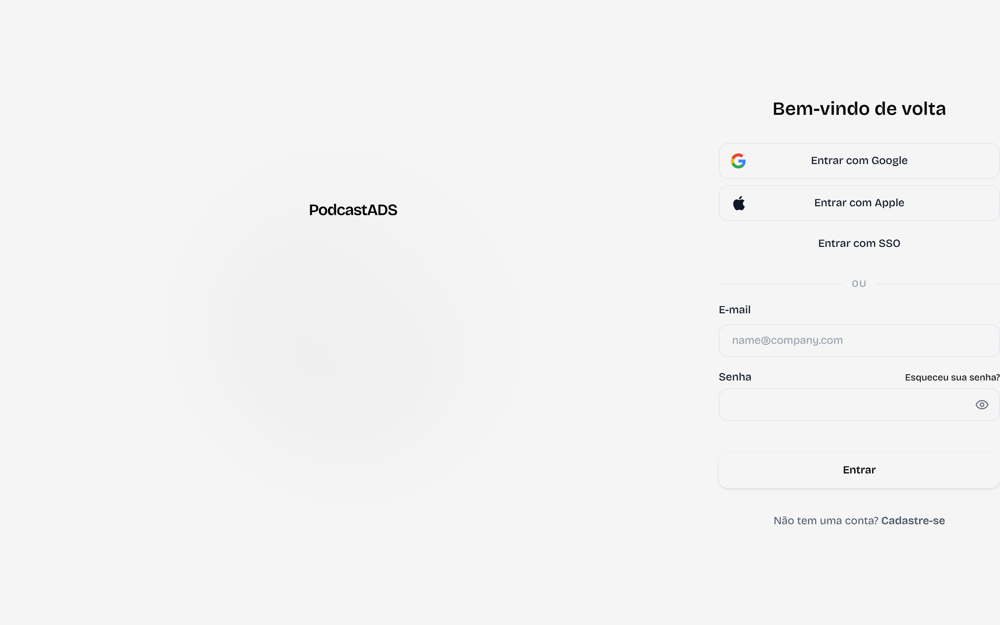
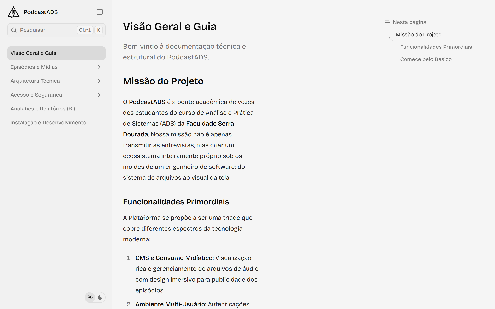
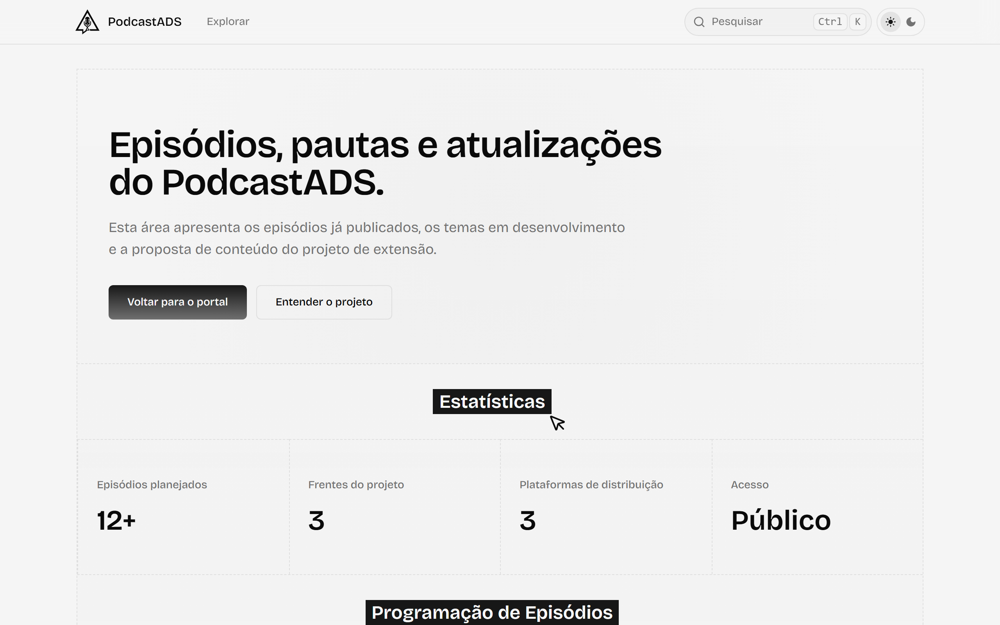
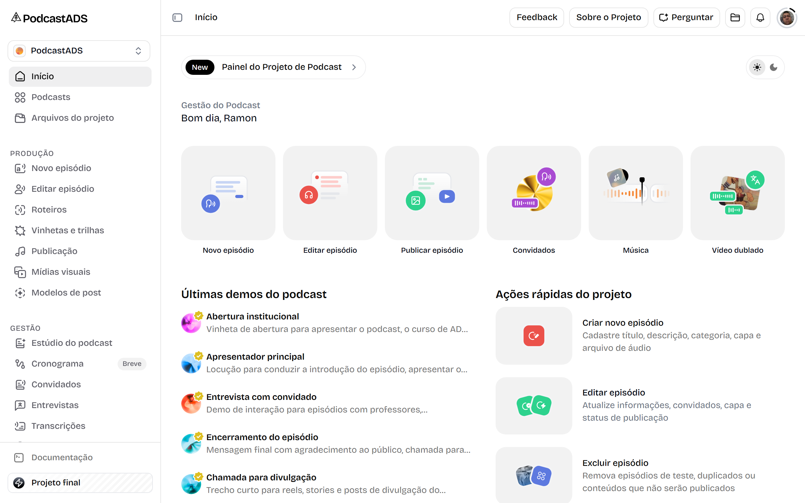
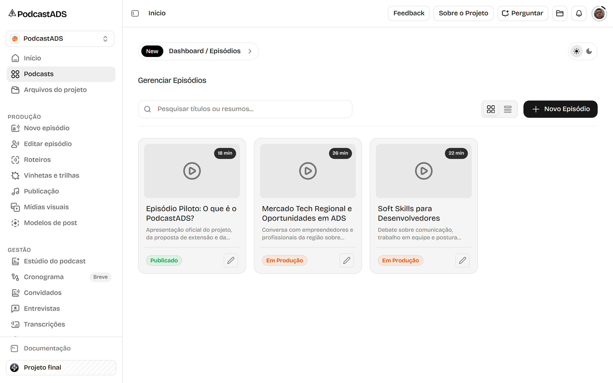
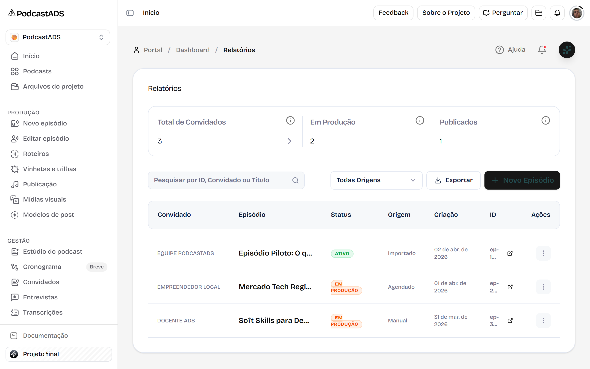

# PodcastADS
**Onde o código encontra a conversa.** 


<p>O portal oficial de tecnologia dos alunos de Análise e Desenvolvimento de Sistemas (ADS) da <b>Faculdade Serra Dourada</b>.</p>

<br />

## Sobre o Projeto

O **PodcastADS** é uma iniciativa estudantil dedicada a conectar alunos, professores e profissionais do mercado. Nossa missão é fortalecer o ecossistema acadêmico através da disseminação de conhecimento, tendências de mercado e soft skills essenciais para o futuro desenvolvedor através de áudio, blog e workshops presenciais.

Mais do que apenas um site institucional, criamos uma plataforma robusta desenvolvida totalmente sob a arquitetura de **Monorepo** com *Next.js*, contendo ferramentas administrativas completas, CMS de episódios e painel de Relatórios.

---

## Autenticação

Sistema de autenticação premium com login social (Google, Apple, SSO) e formulário de e-mail/senha — centralizado, responsivo e com suporte a dark mode.

### Tela de Login


<br/>

---

## Documentação Oficial (`/docs`)

Portal de documentação interativo para ouvintes e membros do projeto. Contém guias, referências de conteúdo, arquitetura do sistema e tutoriais para novos colaboradores.


<br/>

---

## Telas da Plataforma (Portal Público)

A interface pública visa atrair alunos e a comunidade acadêmica. O foco é exibir design premium e performance ultra-rápida.

### Home Page
A página oficial de onde tudo começa. Apresenta nossos diferenciais e episódios em destaque.


<br/>

### Episódios
Listagem pública com curadoria de conteúdos de tecnologia, engajamento e aprofundamento.


<br/>

---

## Áreas Administrativas (Dashboard)

Uma das nossas grandes inovações: um painel administrativo com design de padrão industrial (Dark Mode) voltado à gestão fácil do dia a dia do nosso Podcast.

### Dashboard Home
Onde os administradores visualizam as métricas mais importantes num relance e acessam as ferramentas de controle.


<br/>

### Gestão de Episódios (CMS)
Interface para cadastro, edição e administração do ciclo de vida dos conteúdos.


<br/>

### Relatórios Inteligentes
Visualização ágil de Business Intelligence (BI) para acompanhar a evolução do engajamento.


<br/>

---

## Objetivos Tecnológicos

Para atender aos requisitos técnicos exigidos pela universidade e testar nossos limites criativos, o PodcastADS atinge três pilares:

1. **Gerenciamento de Conteúdo (CMS):** Sistema responsivo para o cadastro, edição e publicação de episódios de ponta a ponta.
2. **Painel de BI:** Interface analítica para ajudar decisões sobre os rumos futuros do conteúdo dos alunos.
3. **Automação de Estatísticas:** Coleção de dados automatizadas com escalabilidade no backend (Turbopack + NextJS).

---

## Mapa de Páginas e Rotas da Aplicação

O sistema (Next.js App Router) está organizado em três áreas principais com níveis de permissões diferentes:

### 🧩 1. Área Pública (Acesso Livre)
São as páginas principais voltadas para qualquer visitante acessar, sem nenhuma estrutura de painel de controle.
*   **`/`** (Página Inicial/Landing Page) - *Arquivo:* `app/(home)/page.tsx`
*   **`/episodios`** (Listagem Pública de Podcasts) - *Arquivo:* `app/(home)/episodios/page.tsx`
*   **`/docs`** (Guia do Ouvinte / Documentação Oficial) - *Arquivo:* `app/docs/[[...slug]]/page.tsx`

### 🔐 2. Autenticação
Rotas de acesso ao sistema com suporte a login social e formulário clássico.
*   **`/sign-in`** (Tela de Login) - *Arquivo:* `app/sign-in/page.tsx`

### 📊 3. Área "Dashboard" (Participantes e Ouvintes)
É o painel do sistema para usuários comuns. Ele reaproveita o layout em modo de leitura, restringindo ações avançadas e modificações.
*   **`/dashboard/home`** (Home do dashboard) - *Arquivo:* `app/dashboard/home/page.tsx`
*   **`/dashboard/episodios`** (Visualização de episódios no painel) - *Arquivo:* `app/dashboard/episodios/page.tsx`
*   **`/dashboard/episodios/editar`** (Roteiro/Edição restrita) - *Arquivo:* `app/dashboard/episodios/editar/page.tsx`
*   **`/dashboard/relatorios`** (Visualização de dados/estatísticas ocultando modais de ações) - *Arquivo:* `app/dashboard/relatorios/page.tsx`

### ⚙️ 4. Área "Admin" (Gestores e Equipe do Projeto)
São as rotas onde a equipe de produção possui privilégios totais de CRUD (Criar, Ler, Atualizar, Deletar).
*   **`/admin/home`** (Home completa com criação e gestão gerencial) - *Arquivo:* `app/admin/home/page.tsx`
*   **`/admin/episodios`** (Lista de episódios com modais de edição e botões de ação permitidos) - *Arquivo:* `app/admin/episodios/page.tsx`
*   **`/admin/episodios/editar`** (Acesso completo ao estúdio/editor) - *Arquivo:* `app/admin/episodios/editar/page.tsx`
*   **`/admin/relatorios`** (Relatórios com tabelas contendo opções para exportar, criar novos, etc) - *Arquivo:* `app/admin/relatorios/page.tsx`

---

## Estrutura do Monorepo

Utilizamos `Turborepo` em conjunto com `pnpm workspaces` construindo módulos eficientes.

| Pacote                                       | Propósito no Ecossistema PodcastADS                               |
| :------------------------------------------- | :---------------------------------------------------------------- |
| 🛠️ [`@xispedocs/cli`](./packages/cli)         | Automação local, scripts de setup e CI para episódios/posts.      |
| 🧠 [`@xispedocs/core`](./packages/core)       | Lógica main, utilitários base que todas as aplicações compartilham. |
| 📝 [`@xispedocs/mdx`](./packages/mdx)         | Motor de renderização de artigos escritos em Markdown.            |
| 🎨 [`@xispedocs/ui`](./packages/ui)           | Biblioteca centralizada de Visual Components de ADS.              |

---

## Como Executar Localmente

Siga estas instruções para hospedar o repositório na sua máquina de desenvolvimento.

### Pré-requisitos
Certifique-se de possuir o **Node.js 18+** e o **pnpm 9+** instalados.

### Passos de Instalação e Inicialização

1. Instale todas as dependências na raiz do monorepo:
   ```bash
   pnpm install
   ```

2. Inicialize o serviço principal de documentação e a plataforma em modo desenvolvimento local (Turbopack habilitado):
   ```bash
   pnpm dev:docs
   ```
   > 💡 *Dica:* Se houver problemas com serviços pendurados na porta 3000 em ambiente *Windows*, rode o comando seguro de inicialização à prova de falhas:
   > ```bash
   > pnpm dev:clean
   > ```

3. Acesse a aplicação completa direto no seu navegador rodando em: `http://localhost:3000`

---

<sub>Construído com 💚 pelos alunos de ADS da <b>Faculdade Serra Dourada</b>.</sub>
