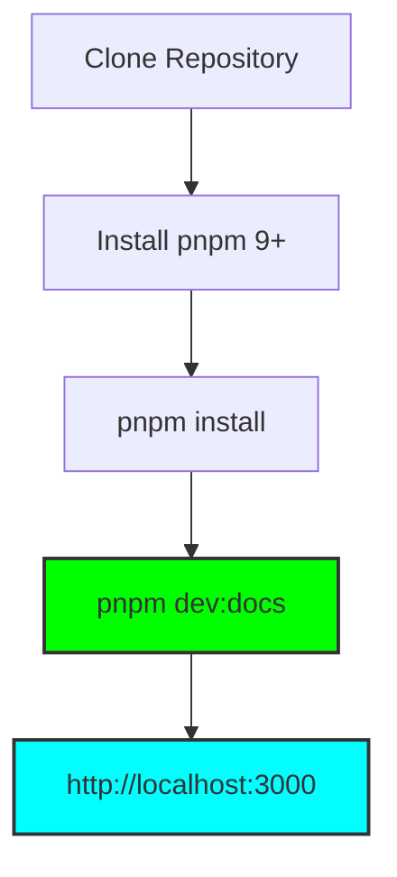

A plataforma de documentação e o portal **PodcastAds** são construídos sob uma arquitetura de Monorepo de alto desempenho. Se você é um novo desenvolvedor ou colaborador acadêmico, siga este guia para configurar seu ambiente de trabalho local.

---

## Fluxo de Configuração (Fast-Track) ⚡

Utilizamos um fluxo linear para garantir que as dependências e o orquestrador Turbo estejam em sincronia:



---

## Requisitos de Sistema

Para operar o ecossistema sem atritos, sua máquina deve atender aos padrões mínimos:

- **Node.js**: Versão 18 ou superior (LTS recomendada).
- **Gerenciador de Pacotes**: **pnpm** (Obrigatório para gestão do Monorepo).
- **Ambiente**: WSL2 (Windows) ou Linux/macOS Nativo para melhor performance de I/O.

---

## Operações do Ciclo de Desenvolvimento

### 1. Preparação do Monorepo

Na raiz do projeto (onde reside o arquivo `pnpm-workspace.yaml`), execute a instalação das dependências:

```bash
pnpm install
```

### 2. Execução do Servidor de Desenvolvimento

A arquitetura utiliza o **Turborepo** para gerenciar a execução simultânea dos pacotes de UI, Core e o aplicativo de Documentação. Execute o comando centralizado:

```bash
pnpm dev:docs
```

<Callout type="warn">
  O comando acima inicia o Next.js no modo `dev` e ativa o HMR (Hot Module
  Replacement) para Markdown e componentes React de forma granular através dos
  pacotes `@xispedocs`.
</Callout>

### 3. Build de Produção e Validação

Para validar que seu código está pronto para deploy (visto pela Vercel), execute a rotina de build completa:

```bash
pnpm build
```

---

## Governança de Código

- **Documentação**: Todo conteúdo reside em `apps/docs/content/docs`. O formato aceito é `.mdx`, permitindo o uso de Componentes React diretamente no texto.
- **Interface (UI)**: Alterações visuais globais devem ser feitas no pacote `packages/ui` para garantir que o Portal e o Admin reflitam a mudança consistentemente.
- **Lógica (Core)**: Scripts de utilidade e interfaces de tipos residem em `packages/core`.

<Callout type="info">
  Use a CLI interna (se disponível via `pnpm xispe`) para acelerar a criação de
  novas pautas e validação de slugs de episódios antes de comitá-los ao Git.
</Callout>
