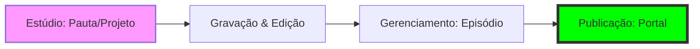

No **PodcastAds**, a gestão de conteúdo segue um rigoroso padrão de Engenharia de Mídia, garantindo que cada pauta acadêmica seja transformada em um ativo digital de alta qualidade. Este ciclo é dividido em fases críticas que conectam o **Estúdio** ao **Portal do Ouvinte**.

## Fluxo Operacional (Workflow)

Utilizamos um pipeline linear para garantir a consistência dos dados e a integridade da mídia:

---

## 1. Fase de Idealização: O Estúdio
Todo conteúdo nasce no `/admin/estudio`. 
- **Projetos**: Representam o estado de rascunho (Draft). Aqui definimos convidados e objetivos pedagógicos.
- **Transição**: Uma pauta só deixa o Estúdio após a conclusão da gravação bruta.

## 2. Fase de Gestão: O CMS de Episódios
A área de `/admin/episodios` é a central de comando para conteúdo finalizado.

### Atributos Técnicos do Episódio
Para que um episódio seja considerado "Production Ready", ele deve conter:
- **Metadados Ricos**: Título chamativo, sumário detalhado e tags de categoria.
- **Thumbnail High-Res**: Imagem representativa seguindo a identidade visual da Faculdade.
- **Mídia Integrada**: URL ou arquivo de áudio processado.

### Gestão de Listagem
O administrador possui duas visualizações para auditoria:
1. **Grade (Grid View)**: Auditoria visual de capas e marketing.
2. **Lista (List View)**: Edição em massa e verificação rápida de paramentros técnicos.

---

## Technical SOP (Standard Operating Procedure) 🛠️

Para operadores de mídia e desenvolvedores, o sistema impõe as seguintes regras de integridade:

<Callout type="warn">
- **Integridade de Arquivos**: O sistema valida a tipagem MIME para garantir que apenas áudios compatíveis sejam publicados.
- **Slugs Amigáveis**: URLs são normalizadas para SEO (Search Engine Optimization) no momento da criação.
- **Persistência Federada**: Alterações no `/admin` são propagadas instantaneamente para o cache do `db.json`, refletindo em tempo real no Dashboard do Ouvinte.
</Callout>

### Resolução de Conflitos
Caso um episódio apresente erro de carregamento:
1. Verifique a validade da URL da mídia no campo `audioUrl`.
2. Certifique-se de que o convidado (`participant`) ainda existe na base de dados.
3. Limpe o cache do Next.js se a alteração for estrutural no `db.json`.
